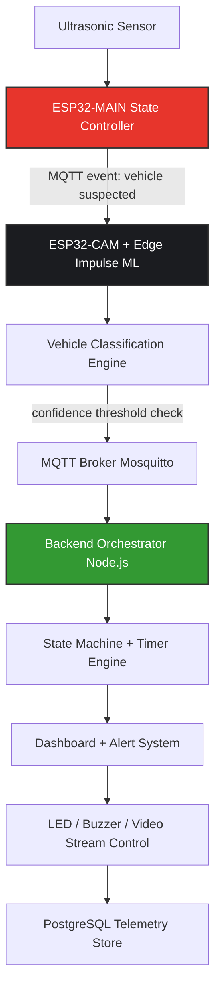

# 👁️ EdgeVision: Distributed IoT + Edge AI Enforcement System
---

## 1. SYSTEM SUMMARY

EdgeVision is a distributed **IoT + Edge AI enforcement system** designed to detect illegal parking in real time using ultrasonic sensing, ESP32-based vision inference, and cloud-backed orchestration.

It solves the problem of **manual, delayed, and inconsistent parking enforcement** by introducing an automated pipeline that escalates from detection ➔ classification ➔ violation ➔ enforcement action using edge devices and MQTT-driven coordination.

> **Domain:** Smart City IoT • Edge AI • Real-time Detection Systems

---

## 🚀 SKILL MAPPING (Recruiter View)

### 🌐 IoT & Distributed Systems
* MQTT-based distributed device communication
* Multi-node sensor network coordination
* Edge-to-cloud event streaming systems

### 🧠 Edge AI / Embedded Systems
* TinyML inference on ESP32 devices
* Real-time sensor fusion (ultrasonic + vision)
* Embedded firmware design for state machines

### ⚙️ Systems Engineering
* Real-time violation detection pipelines
* State machine-based escalation logic
* Event-driven control architecture

### 📡 Network Engineering
* Low-latency device communication protocols
* Pub/sub messaging systems (MQTT)
* Edge network optimization techniques

---

## 2. ARCHITECTURE OVERVIEW

### 🗺️ System Flow



### 📋 Component View

| Layer | Component |
| --- | --- |
| **Edge Sensing** | HC-SR04 Ultrasonic |
| **Edge Compute** | ESP32-MAIN + ESP32-CAM |
| **AI Inference** | Edge Impulse TinyML |
| **Messaging** | MQTT (PubSubClient) |
| **Backend** | Node.js + Express + Socket.IO |
| **Database** | PostgreSQL |
| **UI** | React Dashboard |
| **Video** | MJPEG Stream |

---

## 3. FAILURE MODEL / DESIGN ASSUMPTIONS

### 🎯 System Assumptions

* WiFi connectivity is intermittently unstable.
* Edge devices may reboot or drop MQTT sessions.
* Camera inference may fail or return low-confidence predictions.
* Sensors may produce noisy distance readings.

### ⚠️ Failure Cases

* ❌ **False positive ultrasonic trigger** ➔ Mitigated via ML confirmation layer.
* ❌ **ML misclassification** ➔ Threshold gating (confidence $\ge 0.5$).
* ❌ **MQTT delay/loss** ➔ System defaults to SAFE (no violation escalation).
* ❌ **Camera failure** ➔ System resets to IDLE state.

### 🔒 Trust Boundaries

* ESP32 devices are **untrusted signal generators**.
* Backend is the **single source of truth for violation state**.
* Edge ML is **probabilistic, not authoritative**.

---

## 4. CORE ENGINEERING DESIGN

### 🔄 State Machine (ESP32-MAIN)

```
  IDLE
   ↓
  SOMETHING_DETECTED (ultrasonic trigger)
   ↓
  VEHICLE_CONFIRMATION (ML required)
   ↓
  VEHICLE_DETECTED (confidence ≥ 0.5)
   ↓
  VIOLATION_TIMER (30s countdown)
   ↓
  VIOLATION_STATE
   ↓
  RESET / RESOLVE

```

### 🪜 Violation Escalation Logic

* **Step 1:** Physical detection (ultrasonic)
* **Step 2:** Visual confirmation (ESP32-CAM)
* **Step 3:** ML classification (car / no-car)
* **Step 4:** Time-based persistence check (30s)
* **Step 5:** Violation trigger

### 📡 MQTT Communication Protocol

```text
node/<zone>/sensor
node/<zone>/camera
node/<zone>/ml_result
node/<zone>/state
node/<zone>/command

```

---

## 5. OBSERVABILITY / TELEMETRY

### 🗂️ Events Captured

* `vehicle_detected`
* `ml_confidence_score`
* `violation_triggered`
* `system_state_change`
* `camera_stream_latency`
* `mqtt_round_trip_time`

### 📝 Example Logs

```json
{
  "event": "VEHICLE_DETECTED",
  "confidence": 0.87,
  "zone": "parking_zone_c1",
  "latency_ms": 620
}

```

```json
{
  "event": "VIOLATION_ESCALATED",
  "timer": 30,
  "action": "BUZZER_TRIGGERED"
}

```

### 📊 Metrics

* **⚡ Detection latency:** 500–800ms
* **🎬 Stream latency:** 2–3s
* **🧠 ML inference:** 200–300ms
* **🔋 System uptime:** Edge-dependent

---

## 6. DEPLOYMENT / USAGE

### 🟢 Backend

```bash
cd backend
npm install
npm start

```

### 💾 ESP32 Firmware

```bash
# ESP32-MAIN
Arduino IDE → Upload

# ESP32-CAM
Arduino IDE → Flash with Edge Impulse model

```

### 🔌 MQTT Broker

```bash
mosquitto -c mosquitto.conf

```

### 💻 Frontend

```bash
cd frontend
npm install
npm run dev

```

---

## 7. DESIGN TRADEOFFS / LIMITATIONS

### ✅ Optimizations

* Edge inference reduces cloud dependency.
* MQTT chosen for lightweight pub/sub topology.
* Threshold-based ML reduces compute overhead.
* MJPEG used instead of RTSP for architecture simplicity.

### ⚖️ Tradeoffs

* No hard real-time guarantees (highly WiFi dependent).
* ML accuracy limited by raw ESP32 memory and hardware constraints.
* Video stream quality intentionally reduced to preserve latency limits.
* Single broker architecture (no multi-node clustering configured natively).

### 🛑 Known Limitations

* Performance degrades visibly under high network congestion.
* No offline queueing mechanics for edge MQTT events during a network dropout.
* Limited scalability beyond local implementations without introducing broker scaling.

### 🔮 Future Improvements

* Replace MQTT with Apache Kafka for large-scale enterprise data streaming.
* Add multi-broker network redundancy.
* Upgrade ESP32-CAM to higher-performance edge TPU hardware modules.
* Add an anomaly detection layer directly onto the incoming telemetry stream.

---

## 8. SYSTEM DESIGN PRINCIPLE
**Principle: “Confirm before escalate, observe before act.”**
This system is built on three invariants:

1. No single sensor can trigger a violation alone

2. Every escalation requires multi-layer confirmation

3. System always defaults to SAFE state on uncertainty


---

## 📁 REPOSITORY STRUCTURE

```text
EdgeVision-IoT-Enforcement-System/
│
├── ESP32/                           → Edge hardware layer (real-world sensing + actuation)
│   │
│   ├── ESP32-MAIN/                  → Primary sensor & state controller node
│   │   └── ESP32-MAIN.ino           → Ultrasonic sensing, LED signaling, buzzer alerts
│   │
│   ├── ESP32-CAM/                   → Vision + inference node (edge AI layer)
│   │   └── ESP32-CAM.ino            → Camera capture + TinyML inference pipeline
│   │
│   └── ML_Model/                    → Embedded ML artifacts (Edge Impulse runtime)
│       └── illegal-parking-car-detection_inferencing/
│                                    → Pretrained car detection model for ESP32-CAM
│
├── backend/                         → Cloud orchestration & decision engine
│   │
│   ├── src/
│   │   ├── server.js                → System entrypoint (Express + MQTT + Socket.IO bridge)
│   │   ├── config/                  → Environment + database + MQTT configuration
│   │   ├── routes/                  → API endpoints for dashboard/control plane
│   │   └── services/                → Core logic (state machine, timers, violation engine)
│   │
│   └── package.json                 → Backend runtime dependencies + scripts
│
├── frontend/                        → Observability + control dashboard (human interface layer)
│   │
│   ├── src/
│   │   ├── App.tsx                  → Main UI runtime (dashboard shell)
│   │   ├── components/              → Reusable visualization + control components
│   │   ├── context/                 → Global state (zone status, alerts, telemetry)
│   │   ├── services/                → API + MQTT subscription handlers
│   │   └── styles/                  → UI styling system
│   │
│   └── package.json                 → Frontend dependencies + build scripts
│
├── md_Files/                        → System documentation layer
│   └── architecture.md              → Extended system design + diagrams
│
├── LICENSE                          → MIT license (open usage boundary)
└── README.md                        → System-level documentation entrypoint

```

---

## 🎥 VIDEO DEMO

* **🎬 Live System Demo:** [Watch on Google Drive](https://drive.google.com/file/d/1TSXFx4bkya--dbuV1GhmrOQQIrGRqzua/view)
* **🔄 End-to-End Flow Demo:** [Watch on Google Drive](https://drive.google.com/file/d/1yai9J0rBJ-RyXSsxcO8-n4GXpXs1HBnq/view)

```

```

```

```
